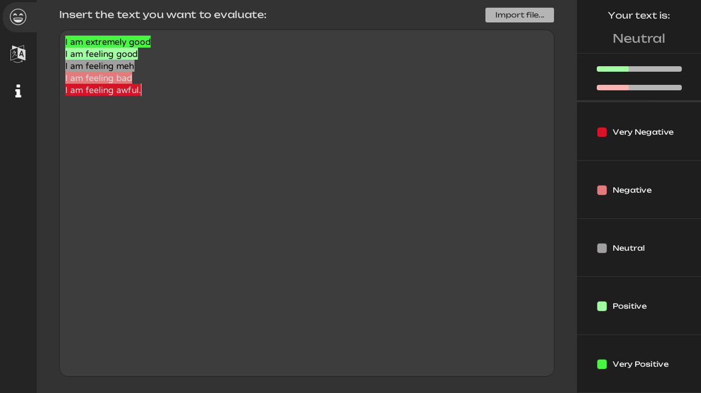
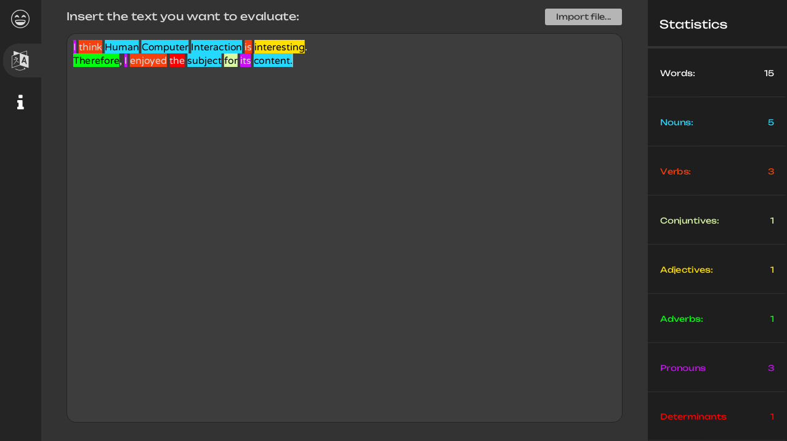

# Sentimentalyst
Sentiment analysis for the desktop  


## Building
You'll need the Stanford CoreNLP English model:
```bash
wget -P lib/ https://downloads.cs.stanford.edu/nlp/software/stanford-corenlp-models-current.jar
```

Built using openjdk20. Haven't tried other JDK's

### Screenshots:  


