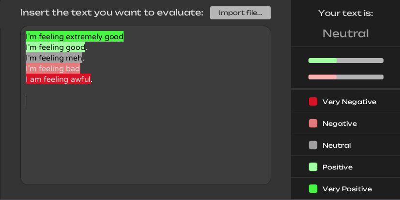
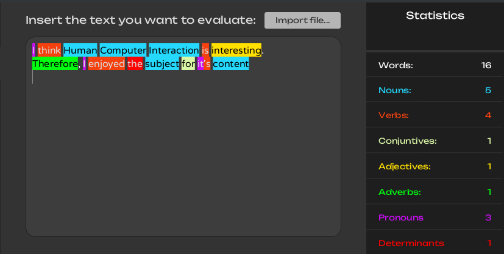

# Sentimentalyst
Sentiment analysis for the desktop  

Screenshots:  




## Building
You'll need the Stanford CoreNLP English model:
```bash
wget -P lib/ https://downloads.cs.stanford.edu/nlp/software/stanford-corenlp-models-current.jar
```
